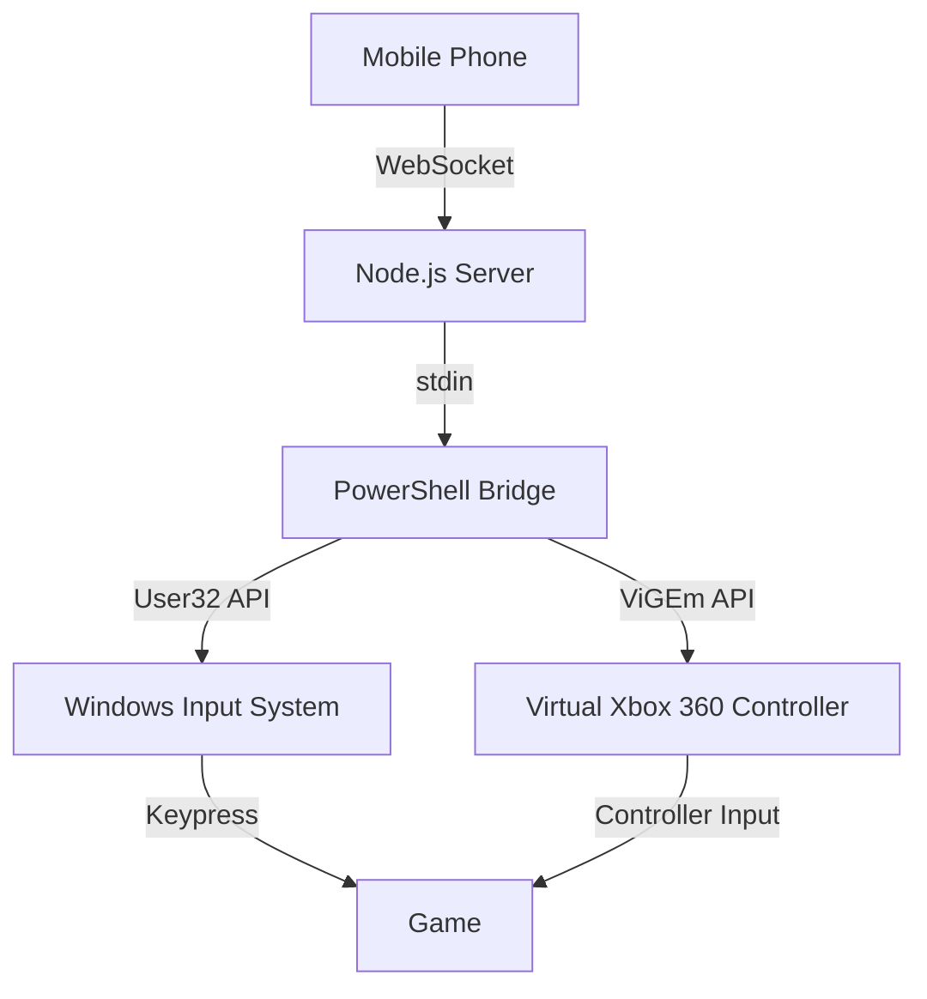

# Architecture

## System Overview
PhantomPad follows a **Remote Controller Architecture** where a mobile device acts as a sensor/input client and a PC acts as the emulator/server.

## Component Layers

### 1. Mobile Client (Sensor Layer)
- **Responsibility**: Captures touch, gyroscope, and button events.
- **Implementation**: PWA (Vanilla JS) or Native Android wrapper.
- **Communication**: Sends binary or JSON input packets via Socket.io to the server.

### 2. PC Server (Orchestration Layer)
- **Responsibility**: Manages client connections, player assignments, and input routing.
- **Implementation**: Node.js (Express/Socket.io).
- **Control Flow**:
    1. Receives input event from a specific `socket.id`.
    2. Identifies the associated `Player`.
    3. Translates the event based on the active `Profile` or `Mapping`.
    4. Routes the command to the Input Bridge.

### 3. Input Bridge (Emulation Layer)
- **Responsibility**: Interfaces with the Windows OS to inject hardware events.
- **Implementation**: PowerShell child process with `user32.dll` access.
- **Modes**:
    - **Keyboard/Mouse**: Direct API calls to `keybd_event` and `mouse_event`.
    - **Gamepad**: Interfaces with the `ViGEmBus` driver using the `Nefarius.ViGEm.Client` .NET library.

## Data Flow

## Key Modules
- `server/index.js`: Main entry point and API/Socket routing.
- `server/input-handler.js`: Core logic for player management and input translation.
- `server/config.js`: Centralized key mappings and default settings.
- `controller/`: Shared logic for the mobile controller interface.
